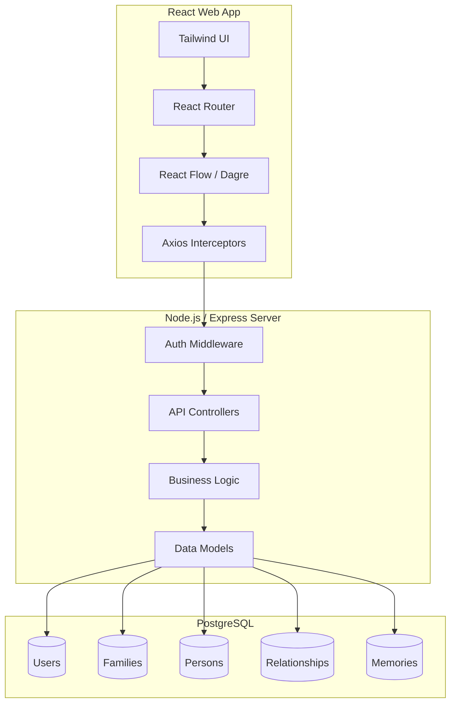

# Family Tree / Family Legacy Platform

A fully-featured, production-ready full-stack application for building, visualizing, and managing your family's legacy. Render highly interactive hierarchical family trees using React Flow while abstracting member profiles securely backed by a normalized PostgreSQL structure.

## 🚀 Project Overview
This platform acts as an interactive workspace bridging generational history documentation with modern dynamic web standards.

**Key Features Include:**
- **Interactive Graphing:** Dagre + React Flow implementations visualizing generational node trees.
- **Node Collaboration:** Granular Role-Based Access controls via email configurations to collaborate with family members.
- **Profiles & Timelines:** Every node connects to a detailed individual biography supporting dynamic `memories` linked across a unified Chronological Timeline sequence.
- **AI Assisted:** Optional capabilities to auto-generate summarized biographic texts parsing internal node dependencies.
- **Exporting Modules:** Instantly capture the node graph directly to a local high-fidelity PNG.
- **Production Built:** Wrapped inside fully configured monolithic Docker specifications.

## 🏗 Architecture Diagram


## 🛠 Tech Stack

**Frontend:**
- **React 18** (Hooks + Functional Components)
- **TailwindCSS** (Utility Styling)
- **React Flow** (Visual Node Orchestration)
- **Dagre** (Automated Hierarchical Layout Engines)
- **Axios** (API Client)
- **React Router v6** (Navigation)

**Backend:**
- **Node.js + Express** (Runtime & Server layer)
- **PostgreSQL** (Relational mapping utilizing explicit `pg` pooling)
- **Bcrypt / JWT** (Encrypted authentication)
- **Express-Validator** (Request object schemas)

**Testing:**
- **Jest + Supertest** (Backend E2E Validation)
- **React Testing Library** (Frontend DOM interactions)

## 🏃 Installation Instructions

1. **Clone the repository:**
   ```bash
   git clone <repo-url>
   cd "Family Tree"
   ```

2. **Backend Setup:**
   ```bash
   cd backend
   npm install
   cp .env.example .env 
   ```
   *Edit the `.env` DB environment configurations corresponding to your active Postgres install.*

3. **Frontend Setup:**
   ```bash
   cd frontend
   npm install
   cp .env.example .env
   ```

## ⚙️ Running the Applications locally

Start the **Backend**:
```bash
cd backend
npm run dev
# Server initiates on http://localhost:5001
```

Start the **Frontend**:
```bash
cd frontend
npm start
# React Dev Server spins up targeting http://localhost:3000
```

Alternatively, fire up everything synchronously utilizing **Docker Compose**:
```bash
docker-compose up --build
```
*(Handles spinning a raw PG 15 node alongside isolated Node & React instances).*

## 🔒 Environment Variables

**Backend (`backend/.env`)**
```env
PORT=5001
DB_HOST=localhost
DB_USER=family_user
DB_PASSWORD=family_password
DB_NAME=family_tree_db
JWT_SECRET=super_secret_key
```

**Frontend (`frontend/.env`)**
```env
REACT_APP_API_BASE_URL=http://localhost:5001/api
```

## 🌍 API Endpoints

### Authentication
- `POST /api/auth/register` - Create an account
- `POST /api/auth/login` - Authenticate, receiving JWT bearer token

### Families
- `POST /api/families` - Provision a new Family entity
- `GET /api/families` - Retrieve user's configured families
- `POST /api/families/invite` - Distribute application access logic via email

### Persons (Nodes)
- `POST /api/persons` - Register a singular Family Member to a Family entity
- `GET /api/persons/:id` - Fetch demographic specifics

### Architecture & Integrations
- `GET /api/family-tree/:family_id` - Retrieves deeply flattened structure format `{ nodes: [], edges: [] }`
- `GET /api/events?family_id=` - Retrieves Timeline chronology
- `POST /api/relationships` - Links two internal `Person` nodes with semantic logic (`parent`, `child`, etc.)
- `POST /api/ai/generate-biography` - Summarize person ID into localized texts

### Example Request (`POST /api/persons`)
```json
{
  "family_id": "uuid-1234",
  "first_name": "Argh",
  "last_name": "Jain",
  "gender": "Male",
  "birth_place": "Earth"
}
```

## ☁️ Deployment Guide

Looking to move architecture to production grids? We recommend utilizing the decoupling strategy:

1. **Database → Supabase or Neon**
   Setup a managed PostgreSQL environment (e.g. Supabase instance) capturing direct connection URI variables. Push `models` SQL structural table constructions directly onto the live instance.
2. **Backend → Render or Railway**
   Link your GitHub repository to Render/Railway configurations targeting the `/backend` folder. Input the raw Supabase postgres `DB_HOST`, `DB_USER`, `DB_PASSWORD` directly alongside finalizing `JWT_SECRET`. 
3. **Frontend → Vercel**
   Deploy explicitly pointing the root to `/frontend`. Override Next.js defaults to force standard `Create React App` builds setting `REACT_APP_API_BASE_URL` identical to your live Render/Railway URL address suffixing `/api`.
